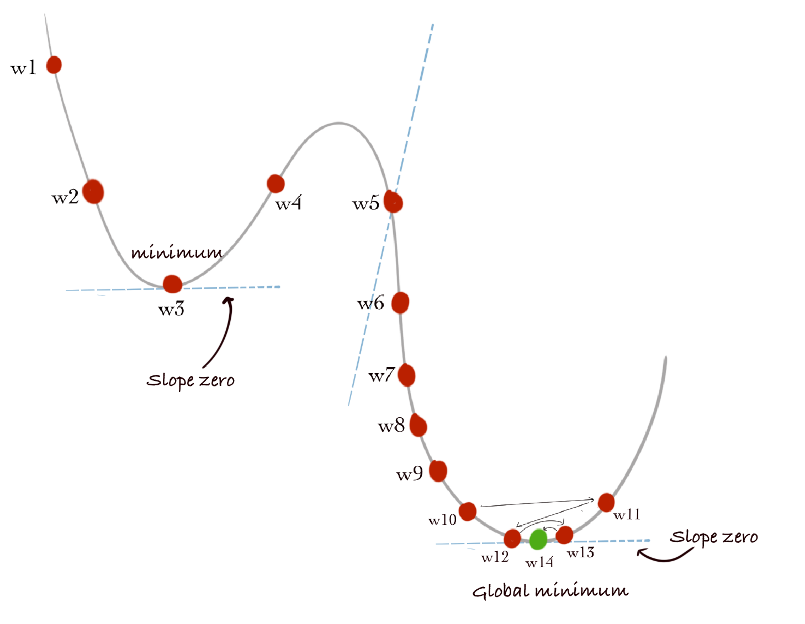

# Deep-Learning
Neural Networks and Deep Learning using Tensorflow

## Algorithm Training Steps:

Given a set of training examples xi with their labels yt the model will:

1.	Initialize the classifier with random weight w
2.	Feed a training example in the classifier and get the output yp
3.	Compute the loss between the prediction yt and yp
4.	Adjust the weights 'w' to improve the loss (error)
5.	Repeat for all training examples.

## Gradiant Descent for optimization

To find the optimal values for the weights (w), the idea is to simply follow the slope of the curve. We keep calculating the slope of a point and move towards the downhill direction until the slope is ~ zero.
slope is nothing but the derivative of the loss function. In calculus, the slope is the derivative of the function at a point. The goal is to find the global min. The minimums, local or global, have a nearly zero derivative, which indicates that we are located at the minimum of the curve. However, that the minimum is not always the global minimum. 

While updating the values of weights, we do it with a constant called learning rate. 

Read more how learning rate and gradient descent works: 
https://medium.com/@swapnilin/learning-rate-hyperparameter-explained-2c1a619cbd33
 

## Feature Extraction
Feature extraction is the transformation of the input data points from the input space to the feature space (high or low dimension) where classification is much easier.

Consider a scenario where each data point is characterized by 20 dimensions. In such cases, discovering an accurate 20-dimensional function to classify the data into two categories becomes time-consuming for the model.

To address this challenge, an alternative approach is employed: the algorithm converts the input to a three-dimensional space. In this transformed space, a classifier can more easily approximate the decision boundary. Later this 3D decision boundary is transformed back to the original 20-dimensional space where it corresponds to a 20-dimensional decision boundary.

It is important to emphasize that the transformed space doesn't necessarily have to be low-dimensional. The choice of the appropriate dimensional space depends on the specific problem and the characteristics of the data.
Usually, only the last one or two layers of a neural network perform the actual classification. The rest account for feature extraction and transforming the input data into a different space where it is possible to classify the data more easily.

